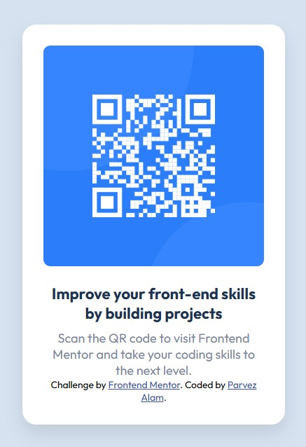

# Frontend Mentor - QR code component solution

This is a solution to the [QR code component challenge on Frontend Mentor](https://www.frontendmentor.io/challenges/qr-code-component-iux_sIO_H). Frontend Mentor challenges help you improve your coding skills by building realistic projects. 
A clean, responsive QR code card built for the Frontend Mentor challenge. Perfect for newcomers to HTML & CSS, with an emphasis on layout, styling, and semantic structure.

## Table of contents

- [Frontend Mentor - QR code component solution](#frontend-mentor---qr-code-component-solution)
  - [Table of contents](#table-of-contents)
  - [Overview](#overview)
    - [Screenshot](#screenshot)
    - [Links](#links)
  - [My process](#my-process)
    - [Built with](#built-with)
  - [Style Guide](#style-guide)
    - [What I learned](#what-i-learned)
    - [Continued development](#continued-development)
  - [Author](#author)

**Note: Delete this note and update the table of contents based on what sections you keep.**

## Overview

### Screenshot

### Links

- Solution URL: [Add solution URL here](https://github.com/alamscode-rgb/fronEndChallenge/tree/main/qr-code-component-main#what-i-learned)
- Live Site URL: [Add live site URL here](https://your-live-site-url.com)

## My process

### Built with
---
- Google Fonts (Outfit)
- Semantic HTML5 markup
- CSS custom properties
- Flexbox
- Mobile-first workflow

## Style Guide
---
- **Font:** [Outfit on Google Fonts](https://fonts.google.com/selection/embed)
- **Colors:**
  - Background: `hsl(212, 45%, 89%)`
  - Card: `hsl(0, 0%, 100%)`
  - Heading: `hsl(218, 44%, 22%)`
  - Paragraph: `hsl(220, 15%, 55%)`
---

### What I learned
- how to use semantic element
- how to use flexbox
- how to give padding margins and lots fo other stuffs

### Continued development

- in future projects i would like to this using grid layout.

## Author

- Website - [Parvez Alam Khan](https://www.your-site.com)
- Frontend Mentor - [@alamscode-rgb](https://www.frontendmentor.io/profile/alamscode-rgb)
- Twitter - [@yourusername](https://www.twitter.com/yourusername)